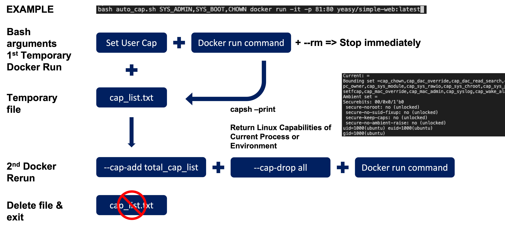

# Docker_AutoPrivilege
Security enhanced program for Docker Privileged mode

This is a project for Security lecture in Konkuk University
-	Developed program for Docker which can run the container in privileged mode with restricted capabilities.
-	Automatically run the docker container with requisite capabilities by getting the types of capabilities from the process that the user wants to run. Used Stack: C and Bash Script
- Sample Case of nginx

